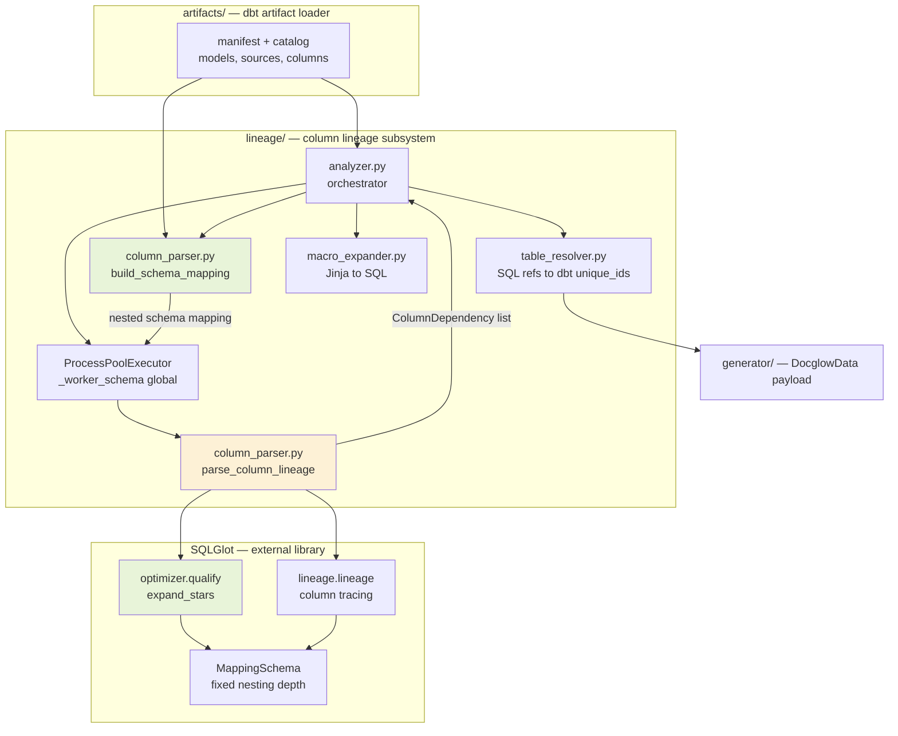

# Components: Docglow column lineage subsystem

**Last updated:** 2026-09-10
**Scope:** C4 L3 for the `src/docglow/lineage/` container only. Scoped deliberately to the
subsystem DOC-317 changes; docglow is a single-process CLI with no database or message queue, so
system-context, container, and ERD diagrams would be fabricated rather than derived.

## Diagram

## Legend

- **Green** — components whose contract DOC-317 changes. `build_schema_mapping` flips its return
  shape from flat-dotted keys to nested `MappingSchema` form; `optimizer.qualify` becomes a new
  call site inside `parse_column_lineage`.
- **Amber** — `parse_column_lineage`, modified but contract-stable: same signature, same
  `dict[str, list[ColumnDependency]]` return.
- **Unstyled** — untouched by this change.
- The `SCHEMAMAP` to `POOL` edge crosses a **process boundary**: the mapping is pickled into
  worker processes and held in the `_worker_schema` module global. Its shape change therefore
  propagates to every worker, not just the parent.
- `MappingSchema` enforces a **single nesting depth** across the whole mapping. This is the
  constraint that makes the reshape a design decision rather than a mechanical edit.

## Change Log

| Date | Change | Reason |
|------|--------|--------|
| 2026-09-10 | Initial generation, scoped to the lineage subsystem | DOC-317 tier M requires an architecture diagram; no prior diagrams existed |
