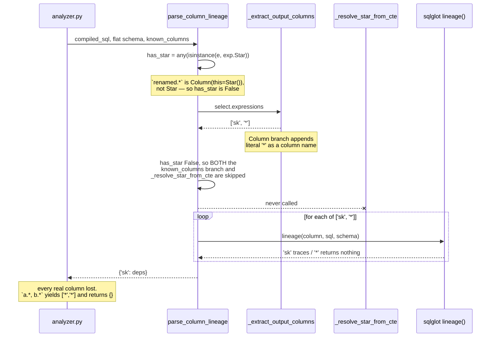
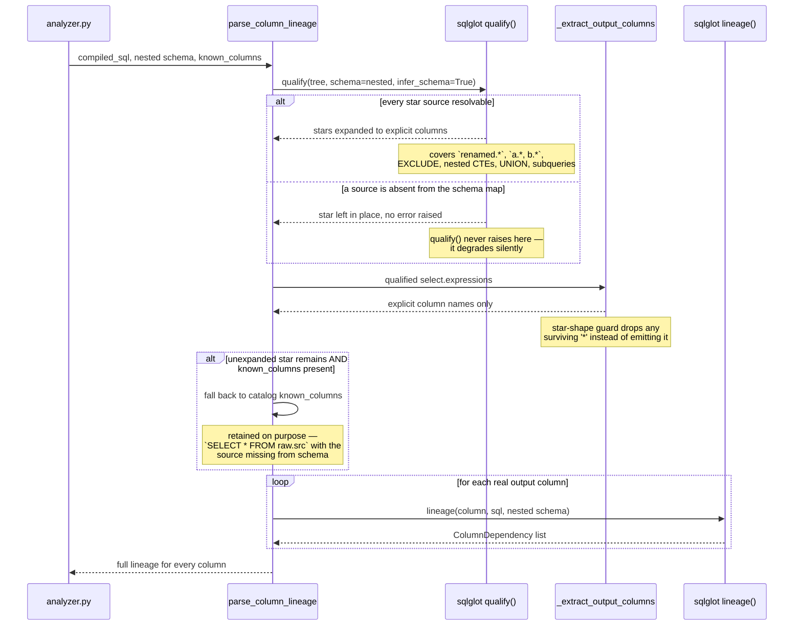

# Sequence: star expansion in column lineage

**Last updated:** 2026-09-10
**Scope:** The projection-expansion path inside `parse_column_lineage`, before and after DOC-317.
This is the flow that decides which output column names get traced.

## Diagram — current behaviour (the defect)

## Diagram — target behaviour (Approach A)

## Legend

- `--x` marks a call that is never reached in the current flow — `_resolve_star_from_cte` is dead
  for every qualified-star input, which is why the CTE resolver never masked the bug.
- The `alt` blocks in the target flow are the two verified degradation paths. Both matter: the
  first is why the `'*'` guard survives the rework, the second is why the `known_columns` fallback
  is not deleted.
- `_resolve_star_from_cte` is removed in the target flow. `qualify()` subsumes it and handles
  cases it never could — the resolver matched a single CTE by name against the first `FROM` table
  only.

## Change Log

| Date | Change | Reason |
|------|--------|--------|
| 2026-09-10 | Initial generation | DOC-317: document the defective and target star-expansion paths |
